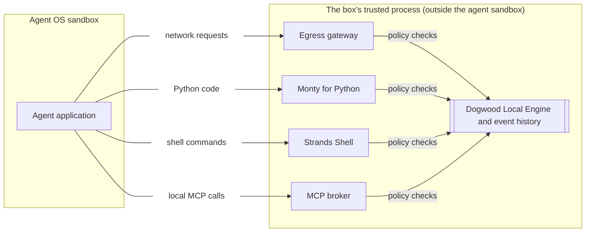
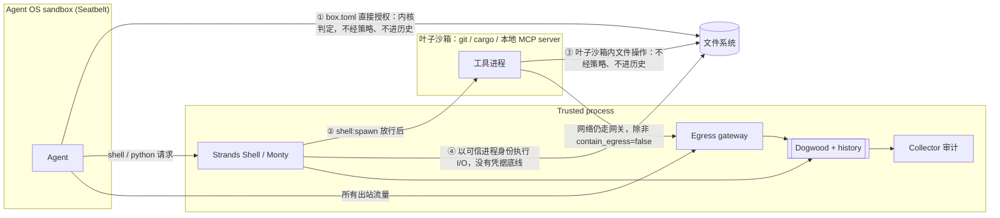

# Strands Box 架构分析

> 基于 [strands-agents/box](https://github.com/strands-agents/box)（commit `2c874ea`）源码与 `docs/design/` 设计文档。

## 1. 官方架构图：把能力搬出沙箱

核心设计：**Agent 自己几乎什么都做不了，真正有副作用的操作都要请沙箱外的可信进程代办，每次代办都先问策略引擎。**

| 通道 | Agent 怎么被引过去 | 如何保证绕不过去 | 策略检查的动作 |
|---|---|---|---|
| network requests | 设置 `HTTPS_PROXY` 等环境变量，指向网关 | Seatbelt 只允许连本机网关端口，不认代理变量的程序什么也连不上 | `net:connect`（目的地）、`http:request`（method、path） |
| shell commands | 在沙箱的 `bin/` 里放名为 `zsh`/`bash`/`sh` 的 alias，通过 `run/box.sock` 转发 | Agent 的 `exec` 白名单里没有真正的 shell | 解析后的 `shell:exec`，加上每个文件副作用的 `fs:*` |
| Python code | 同上，alias 名为 `python3`/`python` | 同上 | 每个文件操作的 `fs:*`；网络只能走 `fetch()`，再经过网关 |
| local MCP calls | 每个 MCP server 一个同名 alias | MCP server 由 Box 在独立沙箱里启动 | 启动时 `shell:spawn`，之后每次调用 `mcp:call` |

这样设计的好处：

- **不用改造 Agent。** Claude Code、Codex 本来就会调 `bash`、`python3`、走 `HTTPS_PROXY`。Box 用同名 alias 和代理变量把这些调用劫持过来，Agent 不需要感知。
- **决策从内核层上移到语义层。** Seatbelt 只能做“这个路径能不能读”这种静态判断。外移之后，可以基于命令、参数、HTTP method/path、MCP 工具参数来判断。
- **一个引擎，一份历史。** 4 个执行点共享同一个 Dogwood 引擎和同一份事件历史，所以能写跨通道的规则，比如：shell 读过 `.env` 之后，网关拒绝所有外发请求。
- **网关终止 TLS。** 所以能看到 HTTP 层的内容，可以按路径做判断，也可以替换凭据：Agent 只拿到占位 token，网关在请求被允许时才换成真实密钥。

本质上这是经典的 **reference monitor / broker 模式**，类似 Chrome 渲染进程和 broker 进程的关系。区别在于判定依据是一套带历史的声明式策略。

## 2. 补全后的架构图：图上没画的旁路

**① Agent 的直接文件授权（`box.toml`）。** Agent 自带的文件工具（Read、Edit 等）直接发系统调用，只有 Seatbelt 管，策略引擎完全看不到。所以 `policy.dw` 里的 `forbid fs:read .env` **只对 shell/Python 通道有效**。如果 `box.toml` 的 `read` 覆盖了 `.env`，Agent 用自己的文件工具照样能读，读取也不进历史，“读过 `.env` 就禁止外发”就被绕过了。官方 Claude Code 示例为此特意只给项目目录 `list` 权限、不给 `read`，强制项目文件都走 Bash 通道。**这是使用 Box 最容易配错的地方。**

**② 工具的叶子沙箱。** Strands Shell 不认识的程序（`git`、`cargo`、`npm`、真正的 CPython）经过一次 `shell:spawn` 决策后在独立沙箱里运行，一次放行覆盖整个进程树。

**③ 叶子沙箱比 Agent 沙箱还宽。** 可以执行任意 helper、加载自己编译出来的代码、探测 home 下文件是否存在；内部的文件操作不经策略、不进历史。放行真 `python3` 或 `bash` 基本等于把那个叶子沙箱的文件权限整个交出去。

**④ 解释器在可信进程里运行。** Strands Shell 和 Monty 在沙箱外执行 I/O，下面**没有凭据底线**（Seatbelt 层对 `~/.ssh`、`~/.aws` 的强制拒绝只作用于沙箱内的进程）。宽泛的 `permit fs:read` 能让解释器替 Agent 读到这些文件。Box 有一个 reachable-paths 检查，只允许 home 和 workspace 范围内的路径，并拒绝 box 自身状态目录，但这不等同于凭据底线。

## 3. 这个架构的代价

| 代价 | 具体表现 |
|---|---|
| 兼容性 | Strands Shell 是自研解释器（vendored 自 `strands-agents/shell`），不是 bash，调用之间不保留状态（`export`、`cd` 不跨命令）。Monty 是 Pydantic 写的 **Python 子集**：没有 CPython，不能 import PyPI 包，`subprocess`、`os.environ`、`Path.resolve()` 都不可用。需要 pandas 这类库就只能放行真 Python 进叶子沙箱，代价见 ②③。 |
| 可信进程集中了风险 | 策略引擎、CA 私钥、所有明文密钥，加上两个要解析 Agent 输入的解释器，都在同一个进程里。解释器有内存安全 bug 就等于可信进程被攻破。官方把它列为已接受的残余风险。更保守的设计会把解释器放进单独的沙箱，只把决策留在可信进程。 |
| 历史不完整 | 时序规则只能看到经过中介的事件，①③ 都是盲区。时序规则是否有效取决于配置是否把敏感数据挡在直接授权之外。 |
| 网关的边界 | TLS 终止要求客户端信任 Box 的 CA，做了证书固定的客户端会失败。非 HTTP 协议（如 SSH 方式的 git）只能在连接层判断。被允许的目的地本身仍可能成为外泄通道，只能靠 method/path 规则收窄。 |
| 性能 | 每个文件操作都要做一次策略决策。目标每次 <1 ms，但文档自己写了“asserted, not yet benchmarked”。 |
| 配置复杂度 | 需要同时维护 `box.toml`（OS 层授权）和 `policy.dw`（语义层授权）两套模型，而且互不覆盖：policy 的 permit 不会扩大 OS 授权，forbid 也撤销不了 OS 授权。 |

## 4. 与 MXC、sandbox-runtime 的本质区别

- **MXC / sandbox-runtime**：沙箱规则在启动时一次性定死，Agent 在边界内做什么都不再询问。属于静态边界。
- **Box**：边界尽量窄，主要能力都通过中介获得，每次使用都做决策并写入历史。属于静态边界加动态中介。

Box 的安全上限更高，能防“先读密钥再外发”这类组合攻击，但前提是接受上面的兼容性代价，并且把配置做对，尤其是 ① 这条路径。

**一句话：** 官方图里的 4 条受控通道只是 Agent 能力的一部分。直接文件授权和叶子沙箱这两条不受策略控制的旁路才决定实际的安全水位，评估或部署时要重点审它们。
